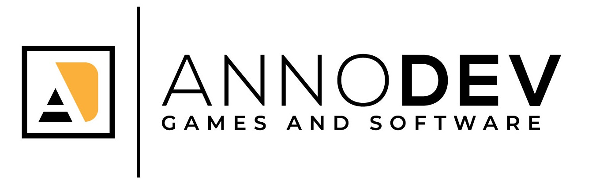

<h1 align="center">From scratch? Yes, please!</h1>

Hi 👋, I'm Pawel Soltysik, also known as Annocholik (not Alcoholic). I was started my career as Gameplay Developer (C#, Unity), now I'm working as Software Engineer - mainly backend (Node.JS). I love to create code from scratch, just to learn how everything is working.

<h2 align="center">Public repositories</h2>

### [AskMe❓ (Node.JS)](https://github.com/annocholik/AskMe) 
Node module package, which allow to create custom console menu. If you require new type of menu -> fork & contribute.

<h2 align="center">Career path</h2>

### [Incuvo](https://incuvo.com/)
When I started working with them, they are only small startup with around 10 members. I was on position Gameplay Developer (Unity), but also I was working as Backend Developer (Node.JS, AWS).

### [DAZN](https://www.dazn.com/)
It's sport streaming company. I was working there, as Softwere Engineer (Node.JS, AWS)

### [AnnoDev](http://www.annodev.com)
It's my company 🏢 - Yey! 😃 For now, I'm working for [The Travel Corporation](https://ttc.com/).

<h2 align="center">Links</h2>

### [Github](https://github.com/annocholik)
### [LinkedIn](https://www.linkedin.com/in/pawe%C5%82-so%C5%82tysik-444528146/)